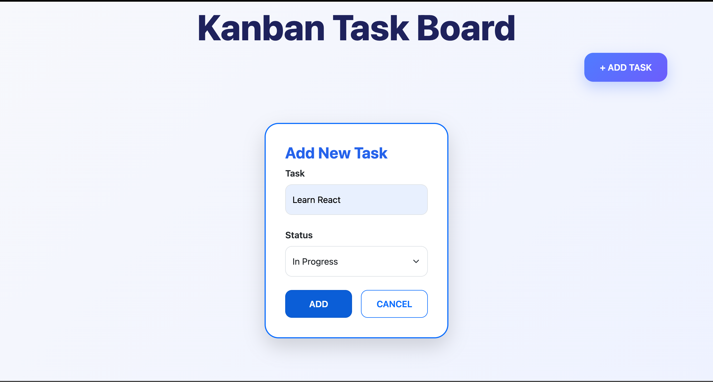
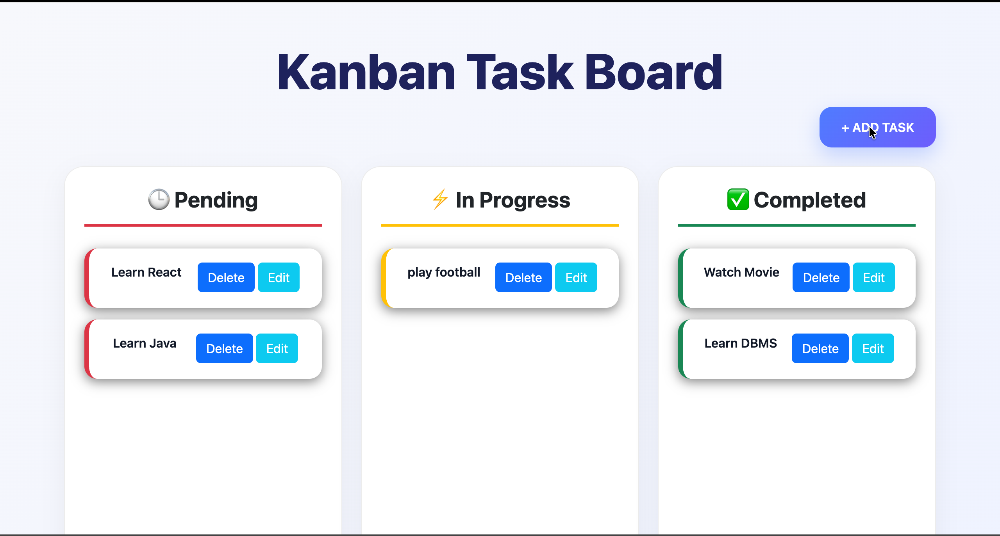
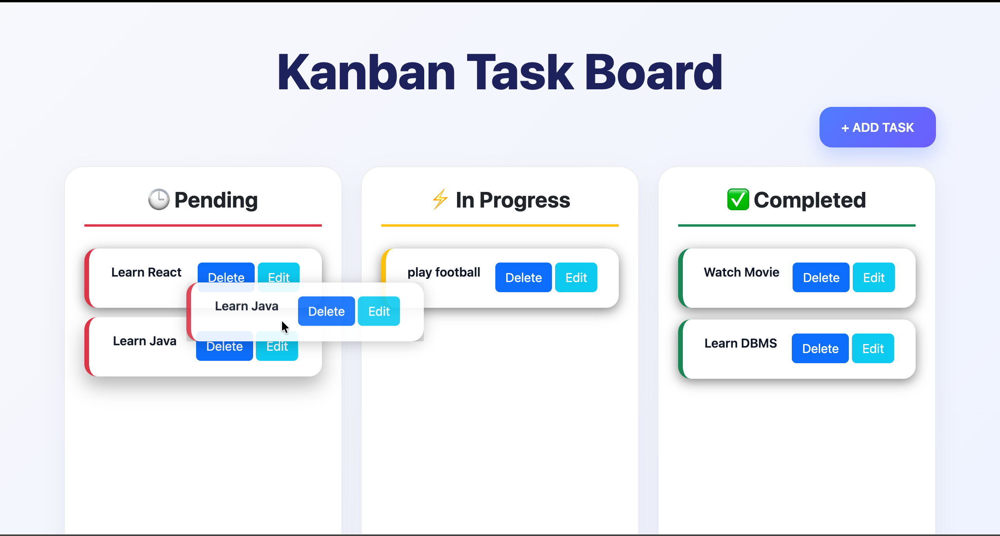
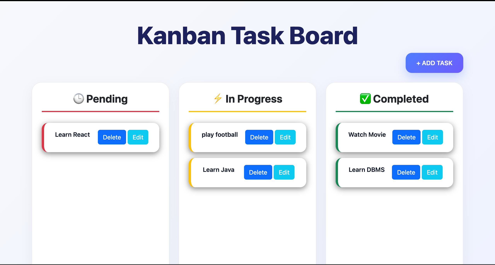

<div align="center">

# 📋 Kanban Task Board

### 🚀 A Modern Drag & Drop Task Management Application

Manage your daily tasks efficiently with a beautiful Kanban Board built using **HTML, CSS, JavaScript, Bootstrap 5**, and **Local Storage**.

<p>
  
  
  
  
  
</p>

</div>

---

# ✨ Overview

Kanban Task Board is a responsive task management application inspired by modern productivity tools like Trello and Jira.

It allows users to organize tasks into different stages of completion while providing an intuitive drag-and-drop interface for seamless task management.

The project is built completely with **Vanilla JavaScript**, making it an excellent demonstration of DOM Manipulation, Object-Oriented Programming concepts, Event Handling, Drag & Drop APIs, and Local Storage.

---

# 📸 Screenshots

## 🏠 Main Dashboard



---

## ➕ Add New Task



---

## 🎯 Drag & Drop



---

## ✅ Task Updated



---

# 🚀 Features

✅ Create New Tasks

✅ Edit Existing Tasks

✅ Delete Tasks

✅ Drag & Drop Tasks

✅ Three Workflow Columns

- ⏳ Pending
- ⚡ In Progress
- ✅ Completed

✅ Automatic Status Update

✅ Beautiful Modern UI

✅ Responsive Design

✅ Local Storage Support

- Tasks remain even after refreshing the browser.

---

# 🛠️ Tech Stack

| Technology | Purpose |
|------------|---------|
| HTML5 | Structure |
| CSS3 | Styling |
| Bootstrap 5 | Responsive Layout |
| JavaScript (ES6) | Application Logic |
| Local Storage | Persistent Data |
| Drag & Drop API | Moving Tasks |

---

# 📂 Project Structure

```text
Kanban_Task_Board/
│
├── images/
│   ├── image-01.png
│   ├── image-02.png
│   ├── image-03.png
│   └── image-04.png
│
├── js/
│   ├── Task.js
│   ├── script.js
│   └── render.js
│
├── index.html
├── style.css
└── README.md
```

---

# ⚙️ How It Works

### 📝 Add Task

- Click **+ Add Task**
- Enter task name
- Select status
- Click **Add**

---

### ✏️ Edit Task

- Click the **Edit** button
- Update the task
- Save changes

---

### 🗑 Delete Task

- Click **Delete**
- Task is instantly removed

---

### 🎯 Drag & Drop

Simply drag a task card from one column and drop it into another.

The task status updates automatically and is saved in Local Storage.

---

# 💾 Local Storage

Tasks are stored inside the browser using Local Storage.

Example:

```javascript
localStorage.setItem("tasks", JSON.stringify(tasks));
```

Even after refreshing the page, all tasks remain available.

---

# 🎨 UI Highlights

- Modern Glassmorphism Design
- Soft Shadows
- Rounded Cards
- Color-coded Status Columns
- Smooth Hover Effects
- Clean Typography
- Responsive Layout

---

# 🧠 JavaScript Concepts Used

- ES6 Classes
- Objects & Arrays
- DOM Manipulation
- Event Listeners
- Drag & Drop API
- Local Storage API
- Array Methods
- CRUD Operations
- Dynamic Rendering
- Template Literals

---

# 📱 Responsive

✔ Desktop

✔ Laptop

✔ Tablet

✔ Mobile

---

# 🚀 Installation

Clone the repository

```bash
git clone https://github.com/your-username/Kanban_Task_Board.git
```

Open the project

```bash
cd Kanban_Task_Board
```

Run

Simply open

```text
index.html
```

or use VS Code Live Server.

---

# 🎯 Future Improvements

- User Authentication
- Dark Mode
- Due Dates
- Priority Levels
- Search Tasks
- Task Categories
- Calendar View
- Firebase Integration
- Backend Support
- Team Collaboration

---

# 🤝 Contributing

Contributions are always welcome.

1. Fork the repository
2. Create a feature branch

```bash
git checkout -b feature-name
```

3. Commit your changes

```bash
git commit -m "Added new feature"
```

4. Push

```bash
git push origin feature-name
```

5. Open a Pull Request

---

# 🌟 Show Your Support

If you found this project helpful,

⭐ Star this repository

🍴 Fork it

📢 Share it with others

---

<div align="center">

### Made with ❤️ by Akash Wakade

**Happy Coding 🚀**

</div>